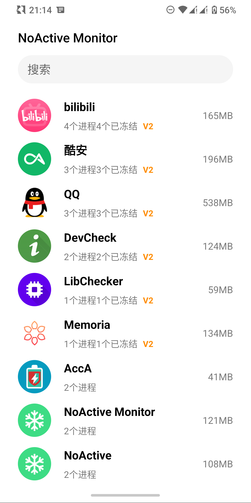
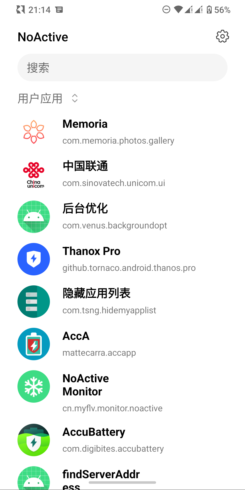
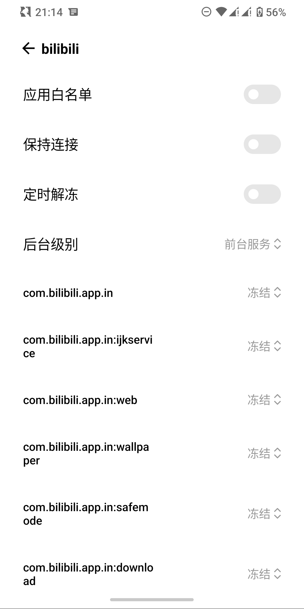
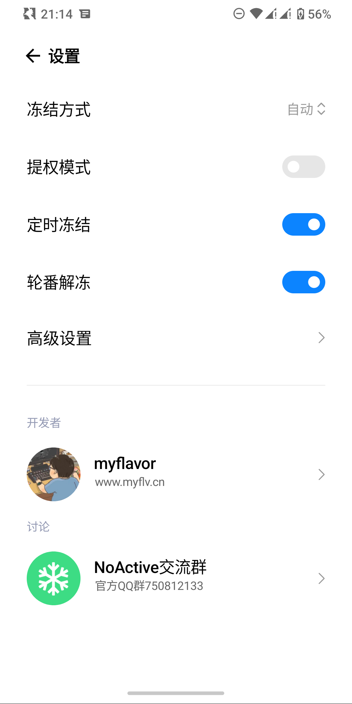
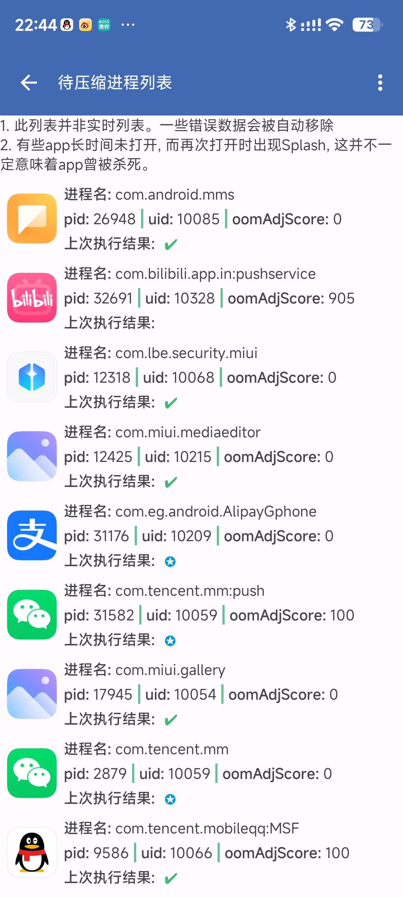

    
    <ul style="display: inline-block; border-width: 0 0 0 1px; border-color: #a1a3a6; border-style: solid; margin: 0 0 0 10px; padding: 0 0 0 10px">
        <li style="list-style: none;"><h2 style="display: inline-block;">BackgroundOpt</h2></li>
        <li style="list-style: none;"><h5 style="display: inline-block;">XingC123</h5></li>
    </ul>

    
    
    
    
    

## 🔮 本模块

**模块名称：** 后台优化(BackgroundOpt)

**模块介绍：** 这是一个通过调整进程oom_score_adj来骗过lmk从而实现保后台的模块。(一定程度上，帮助了国内毒瘤完成曾费尽心思想要实现的保持前台运行的效果。因此，在使用此模块的同时，强烈推荐使用可以控制后台进程cpu使用的另一些模块或是软件，例如墓碑)

## ✨ 特性

1. **oom管理**：通过framework层的hook，来利用LMK机制完成保活。

2. **内存回收:** app进入前/后台后，被加入内存回收列表。该列表以10min为间隔进行轮循，每次运行，会向列表中的app发送特定内存紧张级别。

   **Tip：** 这个功能如果当初研究过qq/微信优化的同学，应该接触过一个叫"QQ/微信负优化"的模块。本模块这个功能便是来自于此。

3. **内存压缩：** app进入后台以后，当进程实际oom_score达到指定规则后，进行内存some/full压缩。

4. **Simple Lmk：** 与内核的slmk不同，本模块的Simple Lmk(以下简称slmk)是基于系统给予的oom_score_adj进行相应处理得来。

   在2.0_vc194中：

   - 所有app的主进程oom分数在[0, 50]，子进程设置了“主进程”以及webview进程保护所使用的为[51, 100]。其余子进程在101+。由此，实现了三级分类。
   - 如果你对某app启用了自定义主进程oom，那么仍将会使用设置的参数，而不会进行处理。
   - 如果你使用了宽松模式，那么模块也不会进行处理。
   - 仅当OOM工作模式为"**平衡模式**"时才生效。

5. **全局OOM：** 开启后会使用给定的oom分数来设置生效范围内的进程。**不推荐开启此功能。**

   - 生效范围: xxx(有界面) -> 只有有界面的app的进程才会被管理。**该值会影响看到的已安装app的数量。**
   - 自定义全局OOM值: 取值范围[-1000, 1000]。**取值-800及以下，可能会导致划卡无法杀后台！！！**
   - 如果app配置了“**自定义主进程OOM**”, 那么会使用此值而不是全局OOM。

## 🔍 安卓版本要求

- 友好支持安卓12-13(Api 31-33)
- 1.6.1(161)初步支持安卓14

> **测试机：**
>
> - Redmi Note 5 pro(whyred): Android13, nusantara rom
> - Redmi K30 pro(lmi): Android12, MIUI 13 22.7.8
> - Android studio自带虚拟机: Android 14

## 📕 食用指南

1. 安装模块
2. 在Lsposed管理器中启用本模块
3. 重启手机

## 💖 致谢

- [Don-t-Kill](https://github.com/UISSD/Don-t-Kill)
- [NoActive-UI](https://github.com/myflavor/NoActive-UI)
- [QQ微信负优化](https://gitee.com/keytoolazy/mapdepot)

## 💫 Q & A

1. Q: MIUI夜间杀后台等做适配了吗？

   A: 已hook

2. Q: 掉卡片有解决吗？

   A: 按照dont kill作者的教程已hook。我的机器暂时没出现。

3. Q: 与"scene附加模块(二)"冲突吗？

   A: 不冲突。我也同时在使用。但正如前言所说，当下新机型内核已上zstd+mglru，且第三方内核对内存管理已做优化，并不推荐过于追求保后台，除非你的机器杀后台杀红眼。

4. Q: 与noactive冲突吗？

   A: 不冲突。

    - 在 **Redmi note5p(whyred), Nusantara, Android 13 + Noactive 2.9**(noa303版本也不冲突)

    - 墓碑效果、app列表、对bili的设置(默认等级为前台服务)、noa的设置页面分别如下:

      
      
      
      

5. Q: 如何知道我又没有食用上呢？

   A: 进入模块主界面, 点击 **待压缩app列表/后台任务列表** , 均可以看到adj信息。

    - 模块(1.6.6_vc189_stable)共有三种模式。分别为：严格模式、宽松模式、平衡模式。三种模式的具体区别如下：

      - 严格模式：模块会设置主进程的最大adj，以及hook系统的oom设置方法。在此模式下，主进程的adj为0。
      - 宽松模式：模块仅设置主进程的最大adj。在此模式下，主进程的adj位于[0, 400]。
      - 平衡模式：仅hook系统的oom设置方法。在此模式下，主进程的adj始终为0(开启Simple Lmk则是另外的)。

    - 子进程adj >= 101

      

6. Q: 我用了以后特别卡怎么解决呢？

   A: 首先，排除所有与本模块无关因素的干扰。然后，由于xp模块的工作原理，在hook点位方法执行前后执行特定代码(不讨论replace)，因此势必会对性能产生一定影响。

   **因此:**

    - 如果你是因为 **保后台进程过多** 造成卡顿，这个 **不归模块管** (模块也不推荐你这么做)。
    - 切换前后台掉帧。可以忍受则继续使用，不可忍受则卸载模块。
    - 信息流滑动掉帧。 **信息流滑动** 的任何事件模块都 **没有进行hook** ，掉帧不关模块的事。

## 💥 注意事项

1. 本模块目前(截至2023/10/16), 仅对安卓12/13(初步适配安卓14)做了适配。
2. 模块在 **"红米Note5 pro(whyred)，安卓13，nusantara"、"红米K30 pro(lmi)，安卓12，MIUI 13 22.7.8"、"Android studio自带虚拟机, 安卓14"** 测试无问题。
3. 任何有关对 **oom_score_adj** 进行调整的模块均与此模块 **冲突**。
4. 可能与去日志版LSP冲突，导致后台任务/压缩列表为空。
5. 本模块主要是对LMK进行处理来进行保活。如果你需要hook厂商的杀后台逻辑，请寻找其他模块。可以只启用本模块对“系统”的作用域，仅开启其他模块对厂商杀后台逻辑所在的位置的作用域。
6. 任何时刻，搞机都要做好砖的准备。如果本模块造成砖机，概不负责(不会真的能砖吧？)，请卸载模块，自行救砖。(如果能提供LSP日志就更好了)

## 📌 下载地址

- [Release](https://github.com/XingC123/BackgroundOpt/releases)
- [蓝奏](https://wwok.lanzoub.com/b0fb3n5cf) 密码: 87qt
- [123云盘](https://www.123pan.com/s/EDCTjv-KBa93.html) 提取码:oo1V